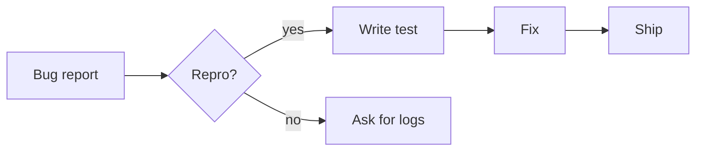
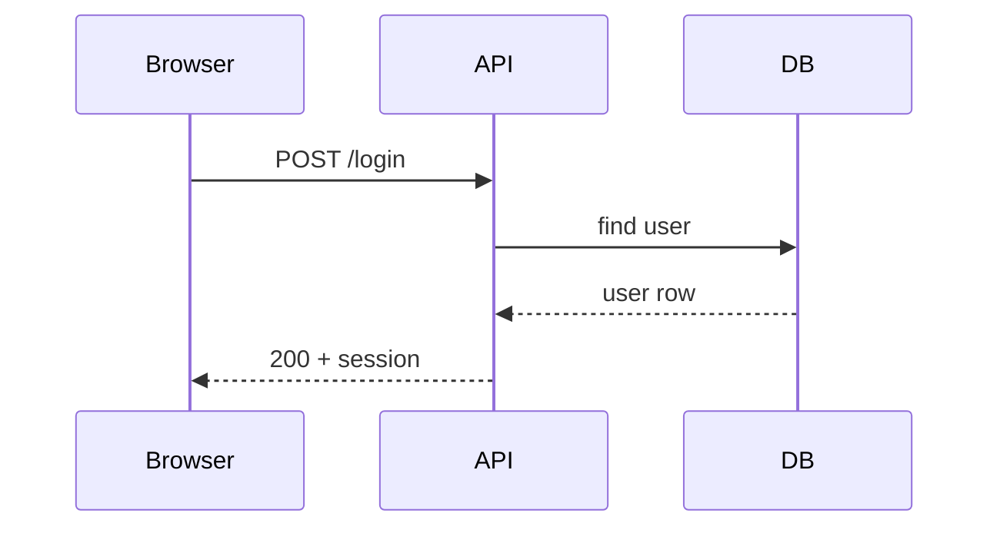

# Plan: ship the login fix

```mermaid
flowchart LR
  A[Bug report]-->B{Repro?}
  B -->|yes| C[Write test]
  B -->|no| D[Ask for logs]
  C-->E[Fix]
  E-->F[Ship]
```

```mermaid
sequenceDiagram
  Browser->>API: POST /login
  API->>DB: find user
  DB-->>API: user row
  API-->>Browser: 200 + session
```
