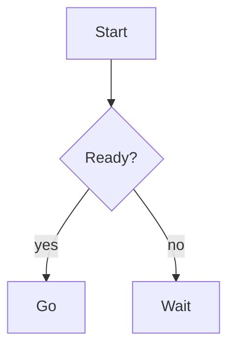
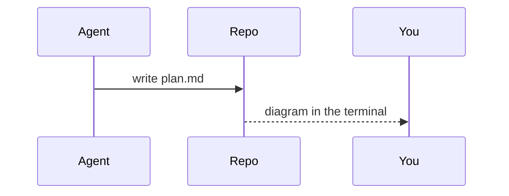
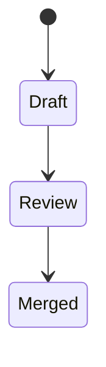
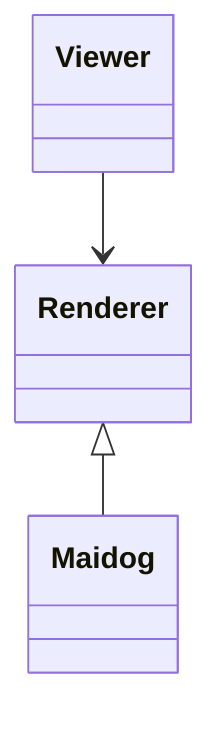
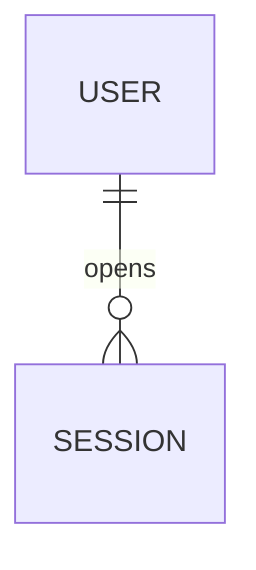

## Flowchart

```mermaid
flowchart TD
  A[Start] --> B{Ready?}
  B -->|yes| C[Go]
  B -->|no| D[Wait]
```

## Sequence

```mermaid
sequenceDiagram
  Agent->>Repo: write plan.md
  Repo-->>You: diagram in the terminal
```

## State

```mermaid
stateDiagram-v2
  [*] --> Draft
  Draft --> Review
  Review --> Merged
```

## Class

```mermaid
classDiagram
  Viewer --> Renderer
  Renderer <|-- Maidog
```

## Entity relationship

```mermaid
erDiagram
  USER ||--o{ SESSION : opens
```
