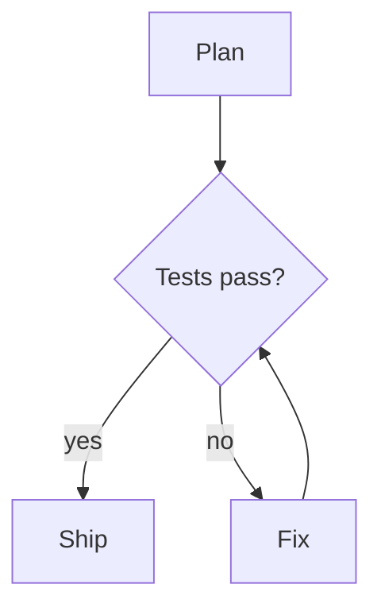
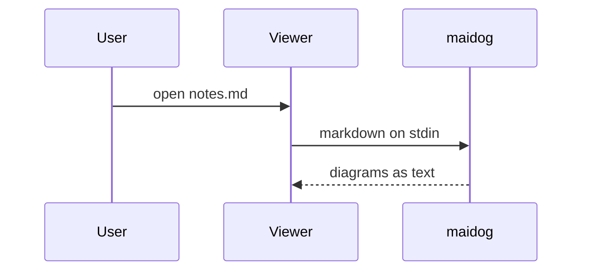
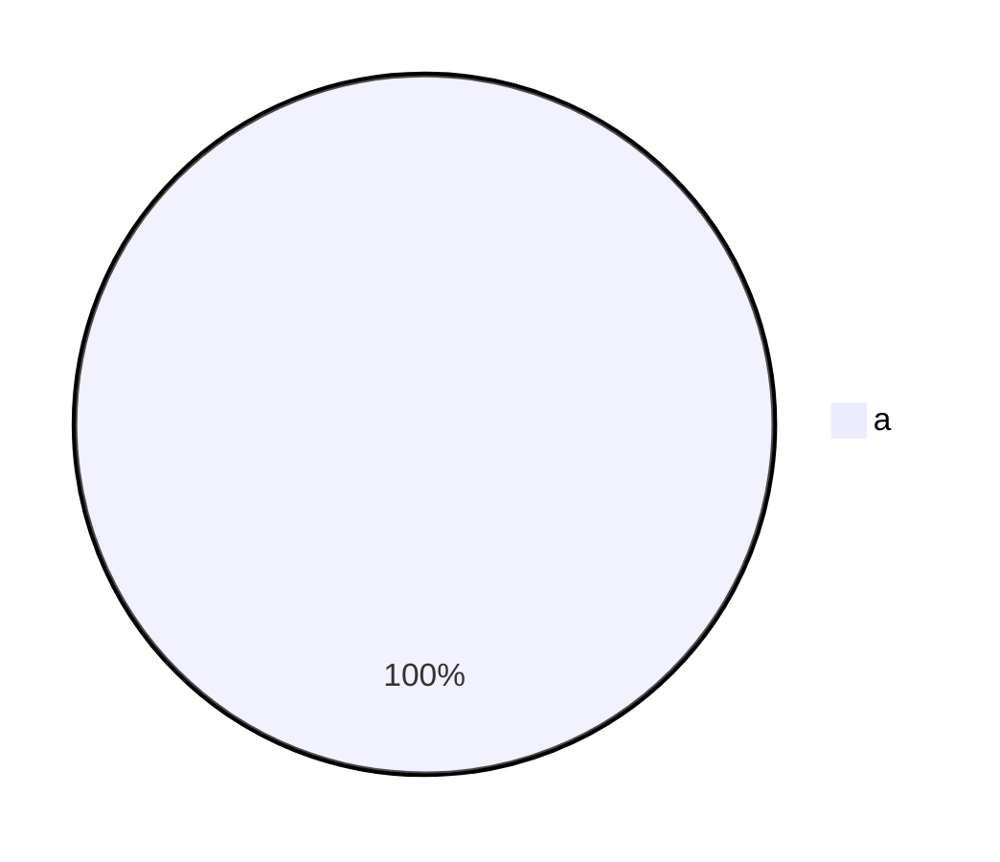

# Release flow

```mermaid
flowchart TD
  A[Plan]-->B{Tests pass?}
  B --> |yes| C[Ship]
  B -->|no| D[Fix]
  D-->B
```

```mermaid
sequenceDiagram
  User->>Viewer: open notes.md
  Viewer->>maidog: markdown on stdin
  maidog-->>Viewer: diagrams as text
```

```mermaid
pie
  "a": 1
```
