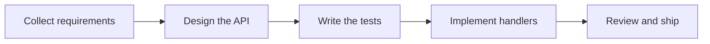
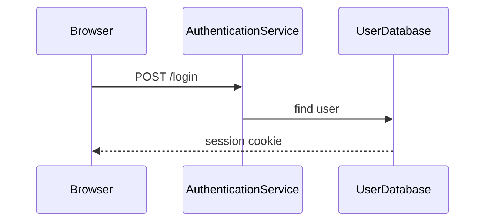

# Wide

```mermaid
flowchart LR
  A[Collect requirements] --> B[Design the API] --> C[Write the tests] --> D[Implement handlers] --> E[Review and ship]
```

```mermaid
sequenceDiagram
  Browser->>AuthenticationService: POST /login
  AuthenticationService->>UserDatabase: find user
  UserDatabase-->>Browser: session cookie
```
